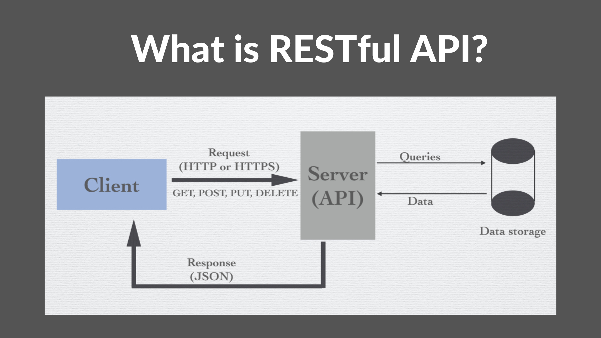

### **1. Introduction**
   - **1.1 What is a RESTful API?**
   - **1.2 Principles of REST**
   - **1.3 Use Cases and Benefits**
   
   

### **2. Planning the API**
   - **2.1 Define the Purpose and Scope**
     - Identify the main functionality.
     - Determine the target users.
   - **2.2 Identify Resources**
     - List out the entities (e.g., users, products).
     - Define relationships between resources.
   - **2.3 API Endpoints**
     - List endpoint paths and associated resources.
     - Organize endpoints by resource (e.g., `/users`, `/products`).
   - **2.4 HTTP Methods**
     - Describe methods (GET, POST, PUT, DELETE, PATCH, etc.) for each endpoint.
     - Explain method purposes (e.g., GET for retrieval, POST for creation).
   - **2.5 Data Formats**
     - Determine supported formats (e.g., JSON, XML).
     - Explain request/response format structure.

### **3. API Design**
   - **3.1 Endpoint Design**
     - Use REST conventions in naming (e.g., nouns in plural).
     - Design URL structures (e.g., `/api/v1/users/{userId}`).
   - **3.2 Query Parameters**
     - Define filtering, sorting, and pagination options.
   - **3.3 Request and Response Examples**
     - Provide sample requests and expected responses for each endpoint.
   - **3.4 Status Codes**
     - List common HTTP status codes used (e.g., 200, 201, 404, 500).
     - Define custom error codes if necessary.

### **4. Authentication and Authorization**
   - **4.1 Authentication Methods**
     - Explain methods used (e.g., API keys, OAuth2, JWT).
   - **4.2 Authorization**
     - Define roles and permissions.
     - Secure sensitive endpoints.

### **5. Error Handling**
   - **5.1 Common Error Responses**
     - List standard error formats.
     - Include error codes, messages, and details.
   - **5.2 Validation Errors**
     - Define how validation errors are communicated to clients.

### **6. Versioning the API**
   - **6.1 Versioning Strategy**
     - Explain versioning methods (e.g., URL-based, header-based).
   - **6.2 Deprecation Policy**
     - Describe how older versions will be deprecated.

### **7. Rate Limiting and Throttling**
   - **7.1 Define Limits**
     - Explain rate limits for requests.
   - **7.2 Throttling Mechanisms**
     - Describe how excessive requests are handled.

### **8. Caching**
   - **8.1 Cacheable Responses**
     - Define which responses are cacheable.
   - **8.2 Cache Control Headers**
     - Explain the use of cache control headers.

### **9. Security Considerations**
   - **9.1 Secure Data Transmission**
     - Explain the importance of HTTPS.
   - **9.2 Input Validation and Sanitization**
     - Prevent common vulnerabilities (e.g., SQL injection, XSS).
   - **9.3 Logging and Monitoring**
     - Define what should be logged and monitored.

### **10. API Documentation**
   - **10.1 Auto-Generated Documentation**
     - Mention tools (e.g., Swagger, Postman).
   - **10.2 Human-Readable Guides**
     - Provide usage examples and tutorials.
   - **10.3 Developer Onboarding**
     - Create a guide for new developers to get started quickly.

### **11. Testing the API**
   - **11.1 Unit and Integration Testing**
     - Describe testing methods.
   - **11.2 Automated Testing**
     - Mention continuous integration tools (e.g., Jenkins, Travis CI).
   - **11.3 API Mocking**
     - Explain the use of API mocks for development and testing.

### **12. Deployment and Maintenance**
   - **12.1 Deployment Strategy**
     - Describe how the API will be deployed (e.g., Docker, Kubernetes).
   - **12.2 Monitoring and Analytics**
     - Tools for monitoring API performance and usage.
   - **12.3 Maintenance and Updates**
     - Plan for regular updates and maintenance.

### **13. Best Practices**
   - **13.1 Use of REST Principles**
   - **13.2 Consistency in Naming Conventions**
   - **13.3 Documentation and Support**
   - **13.4 Performance Optimization**

### **14. Conclusion**
   - **14.1 Recap of Key Points**
   - **14.2 Future Enhancements**
   - **14.3 Additional Resources and References**